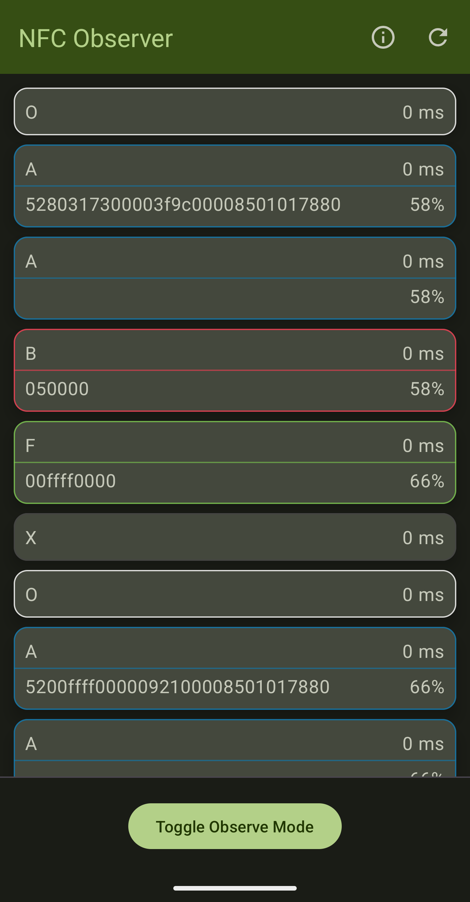
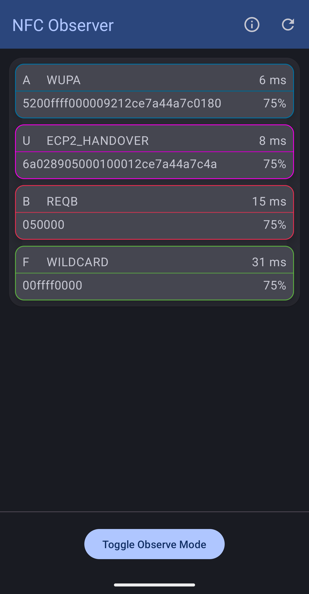
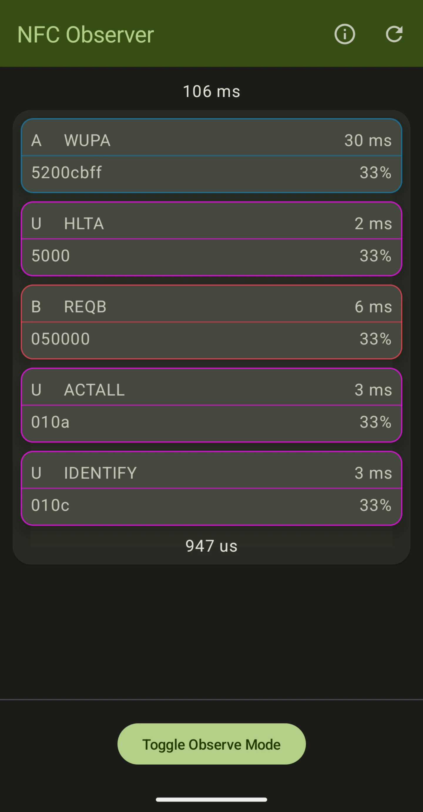

# Android 15 Observe Mode Demo

  
  
  

# Overview

This project provides a demonstration of [Observe Mode](https://developer.android.com/reference/android/nfc/NfcAdapter#isObserveModeSupported()) feature introduced in Android 15, which enables NFC hardware to listen to reader polling without responding to it.

The application allows a user to look at the polling frames sent by the reader, with the following data:
* Type (A, B, F, U*, ON, OFF);
* Delta, the amount of time since a previous polling loop frame;
* Adjusted gain value;
* Payload data.
* Name if applicable;

A user can choose between two display modes:
* Historical data. Displays a full list of all polling loop events, including field activity events and all polling frames;
* Loop data. Displays a unique part of the polling loop generated by a reader based on the detected repeated pattern.

# Requirements

* Android Studio Preview;
* Android VanillaIceCream SDK;
* A compatible Google Pixel Phone, with Android 15 Beta 1.1 or newer installed;
* Any other mobile device or an NFC reader, in order to look at the polling frame data.

# Known issues

* ~~When re-installing the app, Observe Mode might stop working until it is manually turned on and off a couple of times (this could be an issue caused by this app)~~ (Fixed in Beta 2);
* ~~When launching the app initially, there could be a significant delay before the system starts notifying the app about the incoming polling loop events~~ (Fixed in Beta 2);
* [Depending on NFC type and data payload, reported polling frame data may be missing, mutated, or have a mislabeled type](https://issuetracker.google.com/issues/334298675):
    - Type A:
        - ~~Custom frame data is always missing for long frames with or without CRC~~ (Fixed in Beta 2); 
        - Common seven-bit short frames like WUPA or REQA return `52` + some extra bytes of data containing previous polling frames as data instead of just `52` or `26`;
        - ~~Custom seven-bit short frames return no data~~ (Fixed in Beta 2).
    - Type B:
        - Proper frames with CRC are detected as type B frames with proper data.
        - Frames with improper CRC are detected as type U and have an extra byte containing length inside of data part.
    - Type F:
        - No issues as of Beta 2.
    - Type V:
        - Type V frames are unsupported by this API, so they are missing, which is the intended behavior.

# Potential improvements

* ~~Improve the UI by displaying polling frames inside of the RF field activity block instead of displaying field ON and OFF events as separate blocks.~~;
* Add an ability to parse out and display additional information about the polling frame (WIP):
  * ~~Polling frame names, including custom ones~~;
  * Type B:
    * Timeslot count;
    * AFI.
  * Type F:
    * System code;
    * Timeslot count;
    * Request code.
* Improve overall code quality:
  * Refactor project structure, break up modules;
  * Optimize code;
* ~~Add an ability to enable/disable observe mode with a click of a button, allowing the device to respond to a reader if needed~~;
* Improved interaction with the NFC service:
  * Refresh current NFC configuration state not only upon resume or start;
  * Dynamically update list of encountered errors, info about the current state.
* ~~Ability to detect repeating polling loop patterns (frame order, type, data, delta, field events), and provide an option to only display the unique part instead of the whole history~~:
  * Improve polling loop pattern detection stability and performance, as currently a successful detection requires 2 full loops, the algorithm is pretty naive, and there could still be unmanaged corner cases with very weird loops.
* Using the ability to find out polling loop patterns, add an ability to classify/detect specific readers based on this information;
* Improve user interface.

# Notes

* This project has been created without much prior experience with Android development. In case you have found an issue with the app, or can propose an improvement to the source code, feel free to raise an Issue or create a Pull Request.

# References

* [Android Developers - NfcAdapter](https://developer.android.com/reference/android/nfc/NfcAdapter);
* [Android Developers - CardEmulation](https://developer.android.com/reference/android/nfc/cardemulation/CardEmulation);
* [Android Developers - HostApduService](https://developer.android.com/reference/android/nfc/cardemulation/HostApduService);
