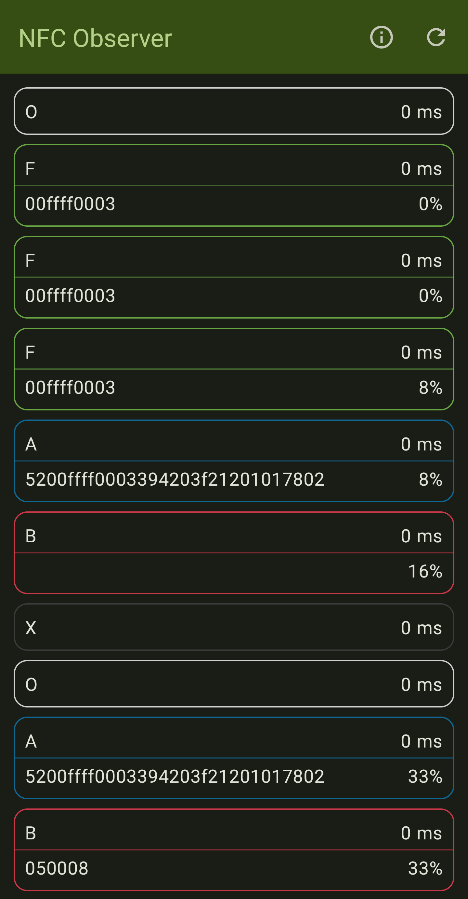
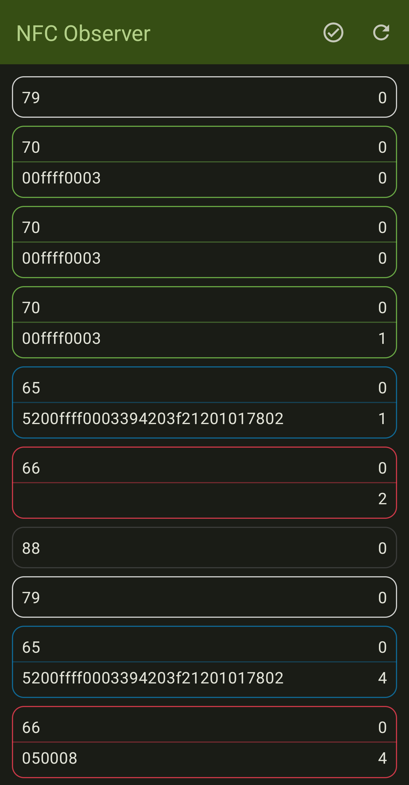

# Android 15 Observe Mode Demo

  
  

# Overview

This project provides a demonstration of [Observe Mode](https://developer.android.com/reference/android/nfc/NfcAdapter#isObserveModeSupported()) feature introduced in Android 15, which enables NFC hardware to listen to reader polling without responding to it.

The application allows a user to look at the polling frames sent by the reader, with the following data:
* Type (A, B, F, ON, OFF);
* Timestamp, the amount of time since a previous polling loop frame;
* Gain value;
* Frame data.

# Requirements

* Android Studio Preview;
* Android VanillaIceCream SDK;
* A compatible Google Pixel Phone, with Android 15 Beta 1.1 or newer installed;
* Any other mobile device or an NFC reader, in order to look at the polling frame data.

# Known issues

* Android 15 Beta 1.0 does not work with the project out of the box due to a SELinux misconfiguration which makes the whole NFC subsystem inoperable. This issue can be overcome with ROOT + SELinux permissive mode, but it's advised to just flash the newest beta version with that issue fixed.
* [Polling frame timestamp values are always zero, which will be fixed in Android 15 Beta 2](https://issuetracker.google.com/issues/335372199);
* [Depending on NFC type and data payload, reported polling frame data may be missing or mutated](https://issuetracker.google.com/issues/334298675):
    - Type A:
        - Custom frame data is always missing for long frames with or without CRC; 
        - Common seven-bit short frames like WUPA or REQA return `5200ffff0003394203f21201017802` as data instead of `52` and `26`;
        - Custom seven-bit short frames return no data.
    - Type B:
        - No issues as of Beta 1.2.
        - Only the data for frames with valid CRC is returned, which is probably the intended behavior.
    - Type F:
        - No issues as of Beta 1.2.
    - Type V:
        - Type V frames are unsupported by this API, so they are missing, which is the intended behavior.

# Potential improvements

* Improve the UI by displaying polling frames inside of the RF field activity block instead of displaying field ON and OFF events as separate blocks.
* Classify polling frame names, including some custom ones;
* Add an ability to parse out and display additional information about the polling frame:
  * Type B:
    * Timeslot count;
    * AFI.
  * Type F:
    * System code;
    * Timeslout count;
    * Request code.
* Improve overall code quality by refactoring it;
* Add an ability to enable/disable observe mode with a click of a button, allowing the device to respond to a reader if needed;
* Ability to detect repeating polling loop patterns (frame order, type, data, delta, field events), and provide an option to only display the unique part instead of the whole history.
* Using the ability to find out polling loop patterns, add an ability to classify/detect specific readers based on this information.

# References

* [Android Developers - NfcAdapter](https://developer.android.com/reference/android/nfc/NfcAdapter);
* [Android Developers - CardEmulation](https://developer.android.com/reference/android/nfc/cardemulation/CardEmulation);
* [Android Developers - HostApduService](https://developer.android.com/reference/android/nfc/cardemulation/HostApduService);
