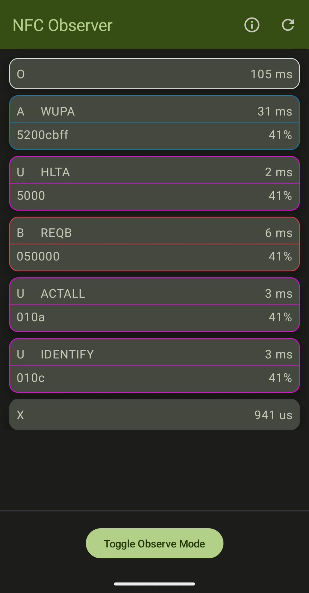

# Android Observe Mode Demo

  
  
  

# Overview

This project demonstrates the [Observe Mode](https://developer.android.com/develop/connectivity/nfc/hce#observe-mode) feature introduced in Android 15, which lets NFC hardware to listen to reader polling without responding to it, so apps can anticipate the reader and prepare to interact with it before commencing the transaction.

The application lets you inspect the polling frames sent by the reader with the following details:
* Type of the frame (A, B, F, U*, ON, OFF);
* Delta, the amount of time since a previous polling loop frame;
* Adjusted gain value;
* Payload data.
* Name if applicable;

A user can choose between two display modes:
* Historical data. Displays a full list of all polling loop events, including field activity events and all polling frames;
* Loop data. Displays a unique part of the polling loop generated by a reader based on the detected repeated pattern.

# Requirements

* Android Studio;
* A compatible device with Android 15 Beta 1.1 or newer installed;
* Another mobile device or NFC reader to act as the polling source.

# Supported devices

| Device series | NFC chip      | Observe Mode support                    | Notes                                                     |
|---------------|---------------|-----------------------------------------|-----------------------------------------------------------|
| Pixel 6 / 7   | ST54J         | ~~Android 15 Beta 1 → Android 15 QPR2~~ | WUPA/REQA and >16-byte frames were not reported correctly |
| Pixel 8 / 9   | ST54L         | Android 15                              | —                                                         |
| Pixel 10      | TBD           | From launch (Android 16)                | —                                                         |
| Galaxy S25    | SN300 (PN544) | Android 15 QPR2                         | —                                                         |

_Note: This list is not exhaustive. Devices that share the listed NFC chips, or newer models in the same families, may support Observe Mode even if they are not mentioned here._

# Potential improvements

* Add the ability to parse and display additional polling-frame details (WIP):
  * Type B:
    * REQB/WUPB:
      * Timeslot count;
      * AFI.
  * Type F:
    * SENSF_REQ:
      * Timeslot count;
      * Request code.
  * Type U:
    * ECP:
      * Configuration parameters;
* Improve overall code quality:
  * Refactor project structure and break up modules;
  * Optimize code;
* Improve interaction with the NFC service:
  * Refresh current NFC configuration state not only upon resume or start;
  * Dynamically update list of encountered errors, info about the current state.
* Improve polling loop pattern detection stability and performance. Detection currently requires two full loops, the algorithm is naive, and unusual loops still cause edge cases.
* Leverage the detected polling loop patterns to classify or detect specific readers based on that information;

# Related terminology

* **Polling Loop Annotation** – a non-standard frame sent by an NFC reader in a discovery loop to provide additional context about the reader field;
* **[Polling Loop (Pattern) Filter](https://developer.android.com/reference/android/nfc/cardemulation/CardEmulation#registerPollingLoopFilterForService(android.content.ComponentName,%20java.lang.String,%20boolean))** – an application-defined filter that asks the OS to forward NFC communication whenever the corresponding frame is detected in a polling loop;
* **[Exit Frame](https://developer.android.com/reference/android/nfc/NfcAdapter#isExitFramesSupported())** – an enhancement of a Polling Loop Filter that allows the NFC controller to pass a transaction through as soon as the matching pattern appears.

# Notes

* This project has been created without much prior experience with Android development. In case you have found an issue with the app, or can propose an improvement to the source code, feel free to raise an Issue or create a Pull Request;
* If you encounter a device that supports Observe Mode but is missing from the [Supported devices](#supported-devices) table, please mention it in an Issue or open a PR.

# References

* [Android Developers - NfcAdapter](https://developer.android.com/reference/android/nfc/NfcAdapter);
* [Android Developers - CardEmulation](https://developer.android.com/reference/android/nfc/cardemulation/CardEmulation);
* [Android Developers - HostApduService](https://developer.android.com/reference/android/nfc/cardemulation/HostApduService);
